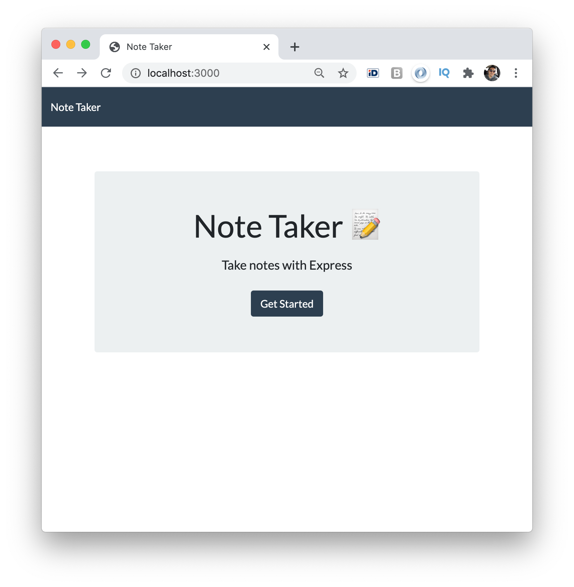

# Note Taker

An application that can be used to write, save, and delete notes. This application uses an express backend, and save and retrieve note data from a JSON file.

## Badges

Code quality and validation

Repository Status

License

## Table of contents

- [Note Taker](#note-taker)
  - [Badges](#badges)
  - [Table of contents](#table-of-contents)
  - [The challenge](#the-challenge)
  - [The development process](#the-development-process)
  - [The Output](#the-output)
  - [Installation and Usage - PENDING](#installation-and-usage---pending)
  - [Credits, tools and other references](#credits-tools-and-other-references)
  - [Contributing](#contributing)
  - [Questions](#questions)

## The challenge

The application frontend has already been created, it's your job to build the backend and connect the two.

Main elements:

- [x] Write, save, and delete notes
- [x] The application should have a `db.json` file on the backend
- [x] The following API routes should be created:

  - GET `/api/notes` - Should read the `db.json` file and return all saved notes as JSON.

  - POST `/api/notes` - Should receive a new note to save on the request body, add it to the `db.json` file, and then return the new note to the client.

  - DELETE `/api/notes/:id` - Should receive a query parameter containing the id of a note to delete. This means you'll need to find a way to give each note a unique `id` when it's saved. In order to delete a note, you'll need to read all notes from the `db.json` file, remove the note with the given `id` property, and then rewrite the notes to the `db.json` file.

## The development process

In order to accomplish the challenge, the following steps were done:

1. Understand the purpose, concept and frontend functionality of the application.
2. Research assets.
3. Include dependencies.
4. Develop and test HTML and API routes.
5. Link frontend with the backend.
6. Final review and proper documentation.

## The Output

With the described process we were able to create a useful and efficient fullstack application that write, save, and delete notes.

**User story**

1. As a user, I can write and save notes, so that I can organize my thoughts and keep track of tasks I need to complete.
2. As a user I can delete notes I have wirtten before, so that I can keep my notes updated.

**The application**

## Installation and Usage - PENDING

The project was uploaded to [GitHub](https://github.com/) at the following repository:
[https://github.com/jorguzman100/11_Note_Taker](https://github.com/jorguzman100/11_Note_Taker)

You can access the deployed application with the Heroku Pages link:
[https://jorguzman100.github.io/11_Note_Taker/](https://jorguzman100.github.io/11_Note_Taker/)

To install the project follow these steps:

1. Step
2. Step
3. Step

## Credits, tools and other references

**Third Party Assets**

[Bootstrap](https://getbootstrap.com/)

[Font Awesome](https://fontawesome.com/)

[Shields.io](https://shields.io/)

[LGTM](https://lgtm.com/)

[Markup Validation Service](https://validator.w3.org/)

## Contributing

- Pull requests are welcome.
- For major changes, please open an issue first to discuss what you would like to change.
- Please make sure to update tests as appropriate.

## Questions

If you have questions or you want to share comments, I will be glad to hear from you. Please contact at jorguzman100@gmail.com.
